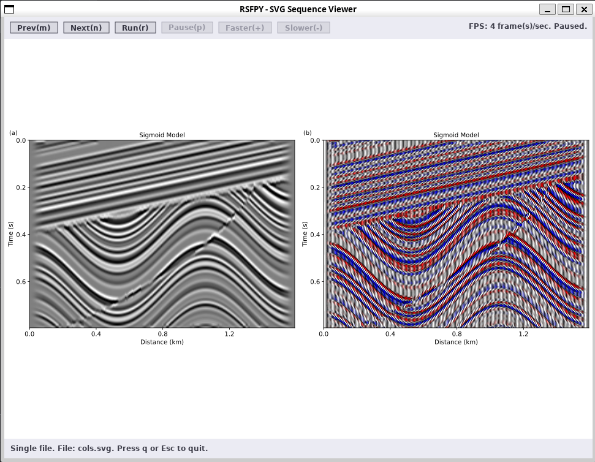
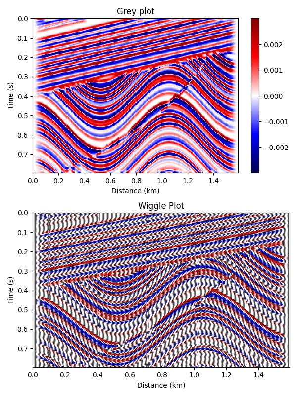

# rsfpy

**rsfpy** is a Python toolkit for reading, writing, manipulating and plotting [*Madagascar*](https://ahay.org "Madagascar Main Page") [<ins>*RSF* (Regularly Sampled Format) </ins>](https://ahay.org/wiki/Guide_to_RSF_file_format "RSF data format")  scientific datasets.  
Built on top of [*NumPy*](https://numpy.org/ "The fundamental package for scientific computing with Python"), it supports efficient slicing, transposing, and subsampling, while automatically updating metadata (e.g., n#/o#/d#/label#/unit#) to keep axis descriptions consistent with data transformations.

## ✨ Features

- 📂 **Data I/O**: Read and write RSF format files
- ⚡ **Highly user-design**: Design your own plot use our command-line tools
- 🛠 **Similar API**: As close as possible to the Madagascar usage
- 🌍 **Applications**: Geophysics, signal processing, seismic imaging, and more
- 🔄 **Totally community**: Just started. Contributions are welcome!

## 📦 Installation
**Strongly recommended to use a virtual Python environment** to isolate dependencies and ensure reproducibility.
```bash
pip install . 
```

### 📚 Requirements
#### Python libraries
- Python >= 3
- Numpy
- Matplotlib
- (*optional*) lxml

Requirements installed by:
```bash
pip install -r requirements.txt

```
#### Others (for building svg viewer)
- gcc/clang
- X11 (libx11-dev)
- Cairo (libcairo2-dev)
- rsvg2 (librsvg2-dev)
- glib2.0 (libglib2.0-dev)

Other requirements installed by:
```bash
sudo apt update
sudo apt install build-essential \
    libx11-dev libcairo2-dev librsvg2-dev libglib2.0-dev
```

Note that the command-line tool **rsfsvgpen** needs **lxml** to deal with svg figures.


## 🚀 Quick start 
### Command-line tools
Two main plot tools are provided: **rsfgrey** (including variants: **rsfgraph**, **rsfwiggle**, **rsfgrey3**) and **rsfsvgpen**

- **rsfgrey (...)** is designed to visualize RSF data in various styles.
- **rsfsvgpen** is used to concatenate, merge, or overlay SVG images generated by **rsfgrey(...)**.
- Each tool is self-documented: simply run the command without arguments to view usage instructions.
```bash
# Command Line
rsfgrey < test/dat.test > test1.svg
rsfwiggle < test/dat.test pcolor=r ncolor=b transp=y zplot=2 > test2.svg
rsfsvgpen < test1.svg test2.svg mode=overlay bgcolor=w > overlay.svg

rsfsvgpen < test1.svg test2.svg mode=grid ncol=1 > rows.svg
rsfsvgpen < test1.svg test2.svg mode=grid nrow=1 > cols.svg

# View the svg images (You can also use other programs)
svgviewer < rows.svg cols.svg

```
You can also use the python API.



### Python API
#### import 
```python
from rsfpy.array import Rsfarray
```
#### Read
```python
### Read from RSF file (file path)
rarray = Rsfarray("./dat.test")

### Read from fileio
with open("./test/dat.test") as fp:
    rarray = Rsfarray(fp)
```
#### Initialize from ndarray
```python
import numpy as np
narray = np.array([1,2,3])
rarray = Rsfarray(narray, 
                  header={'d1':1,'o1':0,'label1':'X', 'unit1':''},
                  history="Ndarray [1,2,3]"
                  )
```

#### Empty array and override
```python
# Empty array
empty = Rsfarray()
# Override array
empty.read("./test/dat.test")
```
#### Write
```python
# Write to file
rarray.write("./test/saved.test", # header file
             out='stdin', # data path, 'stdin' or None: append header file
             form='ascii', # 'native' for binary 
             fmt='%.4e', # The data format for ascii (default is "%f").
             )

# Write to io stuff
meta = io.StringIO()
dat = io.BytesIO()
rarray.write(meta, out=dat)
```
#### Use Rsfarray properties
```python
# Axis
data = Rsfarray("./test/dat.test")
taxis, xaxis = data.axis1, data.axis2
## Or
taxis, xaixs = data.axis([0,1])
# Sampling parameters
nt, dt, ot, label1, unit1 = data.n1, data.d1, data.o1, data.label1, data.unit1
nx, dx, ox, label2, unit2 = data.n2, data,d2, data.o2, data.label2, data.unit2
## Or
nt, nx = data.n([0,1])
dt, dx = data.d([0,1])
## ...

# Try transpose
print(f"before transpose: {data.label1, data.label2}")
data = data.T
print(f"after transpose: {data.label1, data.label2}")

# Window data use .window to sync metadata
print(f"before window: {data.d1, data.o1}")
data1 = data.window("j1=5 f1=100")
## Or
data1 = data.window(j1=5, f1=100)
print(f"after window: {data1.d1, data1.o1}")

```

#### Plotting
``` python
# Grey/wiggle image
## Support subplot mode
import matplotlib.pyplot as plt

data = Rsfarray("./test/dat.test")
fig, ax = plt.subplots(2, 1, figsize=[6, 8])
data.grey(cmap='seismic', show=False, ax=ax[0], colorbar=True, title='Grey plot')
data.wiggle(transp=True, yreverse=True, show=False, ax=ax[1], colorbar=True, title='Wiggle Plot', zplot=2.)
fig.set_tight_layout(True)
fig.show()
```


## Changelog
View changelog [*here*](./CHANGELOG.md "./CHANGELOG.md").

## 📄 License
GNU GPLv2
## 🤝 Contributing
Contributions are welcome! Feel free to open an issue or submit a pull request to improve **rsfpy**

